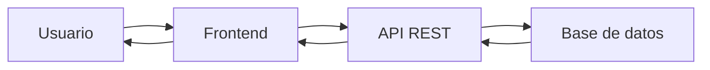
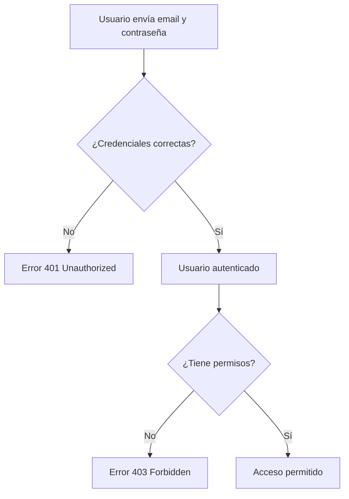
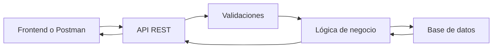

# Día 1: Diseño inicial

## Nombre del proyecto

**UserManager API**

## Descripción del proyecto

UserManager API es una API REST para gestionar usuarios de una aplicación.
Permitirá registrar usuarios, iniciar sesión, consultar perfiles, modificar
datos, gestionar roles y proteger rutas privadas mediante autenticación.

El objetivo del proyecto es construir poco a poco una API de backend completa,
partiendo de un servidor básico y añadiendo después rutas, validaciones,
gestión de errores, persistencia en base de datos, autenticación, autorización e
integración con un frontend real.

## Qué es una API

Una API es una forma de comunicación entre aplicaciones. Sirve para que un
cliente, como una aplicación web o móvil, pueda pedir datos o enviar acciones a
un servidor sin acceder directamente a la base de datos.

Por ejemplo, cuando un usuario inicia sesión, el frontend envía el email y la
contraseña a la API. La API comprueba esos datos, aplica las reglas necesarias y
devuelve una respuesta indicando si el usuario puede entrar o no.



## Recursos principales

La API se organizará en tres grupos principales de rutas.

| Recurso | Explicación |
| --- | --- |
| `/auth` | Servirá para registrar usuarios, iniciar sesión y obtener un token de acceso |
| `/users` | Servirá para consultar, crear, modificar, desactivar o eliminar usuarios |
| `/health` | Servirá para comprobar que la API está funcionando correctamente |

## Modelo de usuario

El recurso principal de la API será el usuario.

```text
User
- id
- name
- email
- passwordHash
- role
- isActive
- createdAt
- updatedAt
```

| Campo | Explicación |
| --- | --- |
| `id` | Identificador único del usuario |
| `name` | Nombre completo del usuario |
| `email` | Correo electrónico del usuario |
| `passwordHash` | Contraseña cifrada del usuario |
| `role` | Rol del usuario, `USER` o `ADMIN` |
| `isActive` | Indica si el usuario está activo o desactivado |
| `createdAt` | Fecha de creación del usuario |
| `updatedAt` | Fecha de última modificación del usuario |

Ejemplo de usuario guardado internamente:

```json
{
  "id": 1,
  "name": "Ana García",
  "email": "ana@email.com",
  "passwordHash": "$2b$10$exampleHash",
  "role": "USER",
  "isActive": true,
  "createdAt": "2026-01-01T10:00:00.000Z",
  "updatedAt": "2026-01-01T10:00:00.000Z"
}
```

La API nunca debe devolver `passwordHash` en sus respuestas, aunque la
contraseña esté cifrada.

## Roles de usuario

La API tendrá dos roles principales.

| Rol | Qué representa | Qué podrá hacer |
| --- | --- | --- |
| `USER` | Usuario normal de la aplicación | Iniciar sesión, consultar su perfil, modificar algunos datos propios y cambiar su contraseña |
| `ADMIN` | Usuario administrador | Listar usuarios, consultar usuarios, cambiar roles, activar o desactivar usuarios y gestionar el sistema |

La autenticación indica quién es el usuario. La autorización indica qué puede
hacer ese usuario dentro del sistema.



## Endpoints principales

| Método | Ruta | Descripción | Acceso |
| --- | --- | --- | --- |
| `GET` | `/api/health` | Comprueba si la API funciona | Público |
| `POST` | `/api/auth/register` | Registra un usuario | Público |
| `POST` | `/api/auth/login` | Inicia sesión | Público |
| `GET` | `/api/users/me` | Consulta mi perfil | Usuario autenticado |
| `GET` | `/api/users` | Lista todos los usuarios | `ADMIN` |
| `GET` | `/api/users/:id` | Consulta un usuario por ID | `ADMIN` o propio usuario |
| `PATCH` | `/api/users/:id` | Modifica un usuario | `ADMIN` o propio usuario |
| `DELETE` | `/api/users/:id` | Elimina o desactiva un usuario | `ADMIN` |
| `PATCH` | `/api/users/me/password` | Cambia mi contraseña | Usuario autenticado |
| `PATCH` | `/api/users/:id/role` | Cambia el rol de un usuario | `ADMIN` |
| `PATCH` | `/api/users/:id/status` | Activa o desactiva un usuario | `ADMIN` |

## Contrato inicial de la API

Un contrato de API define cómo se comunican el cliente y el servidor: qué ruta
se usa, qué método HTTP se necesita, qué datos se envían, qué respuesta se
espera y qué errores pueden aparecer.

### Registro de usuario

```text
POST /api/auth/register
```

Datos que recibe:

```json
{
  "name": "Laura Martínez",
  "email": "laura@email.com",
  "password": "12345678"
}
```

Respuesta esperada:

```json
{
  "id": 2,
  "name": "Laura Martínez",
  "email": "laura@email.com",
  "role": "USER",
  "isActive": true
}
```

Posibles errores:

| Código | Situación |
| --- | --- |
| `400 Bad Request` | Faltan datos o algún dato no tiene formato válido |
| `409 Conflict` | Ya existe un usuario con ese email |

### Consulta de mi perfil

```text
GET /api/users/me
```

Respuesta esperada:

```json
{
  "id": 1,
  "name": "Ana García",
  "email": "ana@email.com",
  "role": "USER",
  "isActive": true,
  "createdAt": "2026-01-01T10:00:00.000Z",
  "updatedAt": "2026-01-01T10:00:00.000Z"
}
```

Esta respuesta no incluye la contraseña ni `passwordHash`.

## Funcionamiento general



El cliente envía una petición a la API. La API valida los datos recibidos,
aplica la lógica necesaria, consulta o modifica la base de datos y devuelve una
respuesta al cliente.

## Reglas iniciales

- El email no se puede repetir.
- La contraseña no se guarda en texto plano.
- La API nunca devuelve `passwordHash`.
- Un `USER` solo puede acceder a su propia información.
- Un `ADMIN` puede gestionar usuarios.
- Un usuario inactivo no puede iniciar sesión.

## Reglas propuestas

- El email debe tener un formato válido.
- La contraseña debe tener al menos 8 caracteres.
- El nombre del usuario no puede estar vacío.
- Un usuario no puede cambiar su propio rol.
- Un `ADMIN` no debería poder desactivarse a sí mismo si es el único
  administrador activo del sistema.

## Posibles errores HTTP

| Situación | Código HTTP | Motivo |
| --- | --- | --- |
| Intentar registrar un email ya existente | `409 Conflict` | El recurso entra en conflicto con un usuario ya registrado |
| Intentar consultar un usuario que no existe | `404 Not Found` | No se ha encontrado ningún usuario con ese identificador |
| Intentar iniciar sesión con contraseña incorrecta | `401 Unauthorized` | Las credenciales no son válidas |
| Intentar listar usuarios con rol `USER` | `403 Forbidden` | El usuario está autenticado, pero no tiene permisos |

## Códigos de estado que usaremos

| Código | Significado |
| --- | --- |
| `200 OK` | La petición se ha realizado correctamente |
| `201 Created` | Se ha creado un recurso |
| `400 Bad Request` | La petición está mal formada o faltan datos |
| `401 Unauthorized` | No se ha iniciado sesión o el token no es válido |
| `403 Forbidden` | El usuario ha iniciado sesión, pero no tiene permisos |
| `404 Not Found` | No se ha encontrado el recurso solicitado |
| `409 Conflict` | Hay un conflicto, por ejemplo un email duplicado |
| `500 Server Error` | Ha ocurrido un error interno del servidor |

## Herramientas previstas

| Herramienta | Uso |
| --- | --- |
| Node.js | Ejecutar JavaScript o TypeScript en backend |
| Express | Crear el servidor y las rutas de la API |
| TypeScript | Añadir tipado al proyecto |
| Postman o Thunder Client | Probar peticiones HTTP |
| Docker | Levantar servicios de forma reproducible |
| PostgreSQL o MySQL | Guardar los datos de usuarios |
| ORM o acceso a datos | Comunicarse con la base de datos |
| JWT | Autenticación mediante tokens |
| bcrypt | Cifrar contraseñas |
| Next.js | Crear un frontend real que consuma la API |

## Resumen del diseño

Antes de escribir código, he definido qué producto se va a construir, qué rutas
tendrá, qué datos formarán parte del modelo de usuario, qué reglas debe cumplir
el sistema y qué errores puede devolver la API.

La primera versión empezará con un servidor sencillo y una ruta de comprobación.
Después se añadirán rutas de usuarios, validaciones, base de datos,
autenticación, roles y conexión con el frontend.
