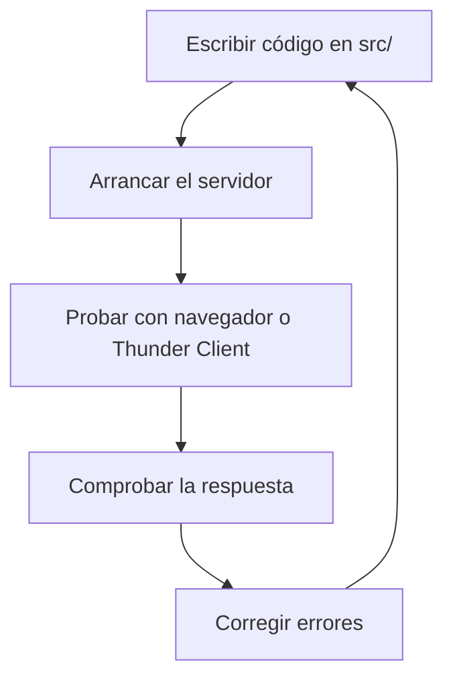

# Día 2: Preparación del proyecto

## Objetivo del día

El objetivo del día 2 ha sido preparar la base técnica de **UserManager API**.
En el día 1 se definió el diseño inicial de la API; hoy se ha creado el
proyecto backend para poder empezar a programar rutas reales en los próximos
días.

Todavía no se ha implementado el CRUD de usuarios ni la autenticación. La idea
de este día es dejar listo un servidor básico con Node.js, Express y
TypeScript.

## Qué he hecho

- He inicializado el proyecto Node.js.
- He instalado Express.
- He instalado TypeScript y las herramientas de desarrollo necesarias.
- He configurado TypeScript con `tsconfig.json`.
- He creado la carpeta `src`.
- He creado el archivo `src/server.ts`.
- He añadido scripts de desarrollo en `package.json`.
- He arrancado el servidor en local.
- He probado la respuesta desde navegador o Thunder Client.
- He documentado el avance del día 2.

## Tecnologías usadas

| Tecnología | Uso en el proyecto |
| --- | --- |
| Node.js | Ejecutar el backend fuera del navegador |
| npm | Instalar dependencias y ejecutar scripts |
| Express | Crear el servidor HTTP y las rutas |
| TypeScript | Escribir código con tipado |
| tsx | Ejecutar TypeScript en modo desarrollo |
| @types/node | Añadir tipos de Node.js |
| @types/express | Añadir tipos de Express |

## Dependencias instaladas

Dependencia principal:

```json
{
  "express": "^5.2.1"
}
```

Dependencias de desarrollo:

```json
{
  "@types/express": "^5.0.6",
  "@types/node": "^25.9.2",
  "tsx": "^4.22.4",
  "typescript": "^6.0.3"
}
```

## Scripts del proyecto

En `package.json` se han definido estos scripts:

```json
{
  "dev": "tsx watch src/server.ts",
  "build": "tsc",
  "start": "node dist/server.js"
}
```

| Script | Comando | Para qué sirve |
| --- | --- | --- |
| `dev` | `npm run dev` | Arranca el servidor en modo desarrollo |
| `build` | `npm run build` | Compila TypeScript a JavaScript |
| `start` | `npm start` | Ejecuta la versión compilada desde `dist/` |

## Comando para arrancar el proyecto

```bash
npm run dev
```

## URL de prueba

```text
http://localhost:3000
```

## Respuesta obtenida

```json
{
  "message": "UserManager API"
}
```

## Estructura actual del proyecto

```text
usermanager-api/
  README.md
  package.json
  package-lock.json
  tsconfig.json
  src/
    server.ts
  docs/
    dia_01_diseno_inicial.md
    dia_02_preparacion_proyecto.md
```

## Configuración de TypeScript

El archivo `tsconfig.json` configura cómo se compila el código TypeScript del
proyecto.

```json
{
  "compilerOptions": {
    "target": "ES2020",
    "module": "CommonJS",
    "rootDir": "src",
    "outDir": "dist",
    "strict": true,
    "esModuleInterop": true,
    "skipLibCheck": true
  }
}
```

| Opción | Explicación |
| --- | --- |
| `target` | Indica la versión de JavaScript que se generará |
| `module` | Define el sistema de módulos usado por Node.js |
| `rootDir` | Indica que el código fuente está en `src/` |
| `outDir` | Indica que el código compilado irá a `dist/` |
| `strict` | Activa comprobaciones estrictas de TypeScript |
| `esModuleInterop` | Facilita importar paquetes CommonJS como Express |
| `skipLibCheck` | Evita comprobar internamente los tipos de librerías externas |

## Archivo principal del servidor

El archivo principal del proyecto por ahora es:

```text
src/server.ts
```

Contenido actual:

```ts
import express from "express";

const app = express();
const PORT = 3000;

app.use(express.json());

app.get("/", (req, res) => {
  res.json({
    message: "UserManager API"
  });
});

app.listen(PORT, () => {
  console.log(`Servidor escuchando en http://localhost:${PORT}`);
});
```

## Explicación personal

El archivo `src/server.ts` es el punto de entrada del backend. En este archivo
se crea la aplicación de Express, se configura para poder trabajar con JSON, se
define una primera ruta de prueba y se arranca el servidor en el puerto `3000`.

`app.listen` sirve para poner el servidor en marcha. Recibe el puerto donde la
API debe escuchar peticiones y una función que se ejecuta cuando el servidor ya
está arrancado. En este proyecto muestra por consola el mensaje:

```text
Servidor escuchando en http://localhost:3000
```

`app.get` sirve para definir una ruta que responde a peticiones HTTP de tipo
`GET`. En este caso se ha creado la ruta `/`, que devuelve un JSON sencillo con
el mensaje `"UserManager API"`.

`express.json()` es un middleware que permite a Express leer cuerpos de
peticiones en formato JSON. Aunque ahora la ruta `/` no recibe datos, será
importante más adelante para endpoints como registro, login o actualización de
usuarios, donde el cliente enviará información en el body.

## Flujo de trabajo

El flujo de trabajo a partir de ahora será:



Este ciclo será importante durante todo el proyecto porque cada ruta nueva debe
probarse después de implementarla.

## Prueba realizada

Para comprobar que el servidor funciona, he arrancado el proyecto con:

```bash
npm run dev
```

Después he accedido a:

```text
GET http://localhost:3000
```

La API ha respondido correctamente con:

```json
{
  "message": "UserManager API"
}
```

Esto confirma que Express está arrancando, que la ruta `/` existe y que el
servidor puede devolver una respuesta JSON.

## Error investigado

Un error posible durante esta preparación es intentar abrir el navegador antes
de arrancar el servidor.

Situación:

```text
Abrir http://localhost:3000 sin ejecutar npm run dev
```

Resultado esperado:

```text
No se puede acceder a este sitio o conexión rechazada
```

Este error significa que no hay ningún proceso escuchando en el puerto `3000`.
La solución es arrancar el servidor desde la terminal:

```bash
npm run dev
```

Después de ejecutar el comando, el servidor queda escuchando en
`http://localhost:3000` y la petición vuelve a funcionar.

## Próximos pasos

En los próximos días se empezarán a crear rutas más parecidas a una API real.
Algunas mejoras previstas son:

- Crear una ruta `GET /api/health`.
- Crear una ruta temporal `GET /api/info`.
- Separar las rutas en archivos propios.
- Añadir controladores y servicios.
- Empezar el CRUD de usuarios.

## Resumen final

El día 2 deja preparado un proyecto backend mínimo pero funcional. Ya existe un
servidor Express escrito en TypeScript, el proyecto puede arrancarse con
`npm run dev` y la API devuelve una primera respuesta JSON desde
`http://localhost:3000`.
