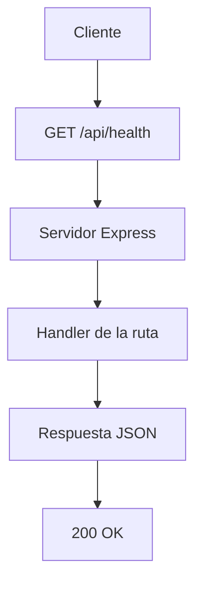

# Día 3: Primer endpoint

## Objetivo del día

El objetivo del día 3 ha sido crear el primer endpoint real de **UserManager API**.
En el día 2 se preparó el servidor básico con Node.js, Express y TypeScript; hoy
se ha añadido una ruta propia de una API REST para comprobar que el backend está
funcionando correctamente.

El endpoint creado es:

```http
GET /api/health
```

Esta ruta sirve para comprobar que la API está viva, responde correctamente y
puede devolver datos en formato JSON.

## Qué he hecho

- He creado el endpoint `GET /api/health`.
- He devuelto una respuesta JSON.
- He usado el status code `200`.
- He añadido un campo `timestamp` con la fecha de la respuesta.
- He probado la ruta desde navegador, Thunder Client o Postman.
- He probado una ruta incorrecta para ver qué ocurre cuando un endpoint no
  existe.
- He documentado el avance del día 3.

## Conceptos trabajados

| Concepto | Qué significa |
| --- | --- |
| Endpoint | Ruta concreta de una API que permite realizar una acción |
| Ruta | Camino que se escribe después del dominio o del puerto |
| Método `GET` | Método HTTP usado para consultar información |
| Request | Petición que envía el cliente al servidor |
| Response | Respuesta que devuelve el servidor al cliente |
| JSON | Formato habitual de respuesta en APIs REST |
| Status code `200` | Código que indica que la petición ha ido bien |

## Endpoint creado

```http
GET /api/health
```

URL completa en local:

```text
http://localhost:3000/api/health
```

## Código añadido

En `src/server.ts` se ha añadido esta ruta:

```ts
app.get("/api/health", (req, res) => {
  res.status(200).json({
    status: "ok",
    message: "UserManager API funcionando",
    timestamp: new Date().toISOString()
  });
});
```

## Respuesta obtenida

```json
{
  "status": "ok",
  "message": "UserManager API funcionando",
  "timestamp": "2026-01-01T10:00:00.000Z"
}
```

El valor de `timestamp` cambia en cada petición porque se genera con la fecha y
hora actuales.

## Explicación personal

El endpoint `/api/health` sirve para comprobar que la API está funcionando
correctamente. Cuando recibe una petición `GET`, devuelve un JSON con el estado
de la aplicación, un mensaje descriptivo y la fecha en la que se generó la
respuesta.

Este tipo de endpoint es habitual en APIs reales porque permite verificar si el
servidor está encendido y si puede responder a peticiones HTTP. Más adelante,
cuando el proyecto tenga base de datos, este endpoint podría ampliarse para
comprobar también la conexión con otros servicios.

## Diferencia entre `/` y `/api/health`

En el día 2 ya existía una ruta básica:

```http
GET /
```

Esa ruta devuelve un mensaje inicial de la API. En cambio, la nueva ruta
`/api/health` tiene una intención más concreta: comprobar el estado del backend.

| Ruta | Método | Para qué sirve |
| --- | --- | --- |
| `/` | `GET` | Devuelve un mensaje inicial de la API |
| `/api/health` | `GET` | Comprueba que la API está funcionando |

## Flujo de la petición



El cliente puede ser el navegador, Thunder Client, Postman o más adelante un
frontend construido con Next.js.

## Pruebas realizadas

Para probar el endpoint, primero se arranca el servidor:

```bash
npm run dev
```

Después se hacen las peticiones HTTP:

| Petición | Código esperado | Resultado obtenido |
| --- | ---: | --- |
| `GET /` | 200 | Devuelve el mensaje inicial de la API |
| `GET /api/health` | 200 | Devuelve el estado `ok`, un mensaje y un `timestamp` |
| `GET /api/no-existe` | 404 | Express indica que la ruta no existe |

## Error investigado

Al probar una ruta que no existe:

```http
GET /api/no-existe
```

Express responde indicando que no puede encontrar esa ruta. Esto es normal
porque todavía no se ha configurado un middleware de errores `404` personalizado.

Más adelante se podrá crear una respuesta JSON común para rutas no encontradas,
por ejemplo:

```json
{
  "error": "Ruta no encontrada"
}
```

## Estado actual del proyecto

La estructura del proyecto después del día 3 es:

```text
usermanager-api/
  README.md
  package.json
  package-lock.json
  tsconfig.json
  src/
    server.ts
  docs/
    dia_01_diseno_inicial.md
    dia_02_preparacion_proyecto.md
    dia_03_primer_endpoint.md
```

## Resumen

En el día 3 se ha creado el primer endpoint real de la API. Aunque es una ruta
sencilla, permite practicar el ciclo de trabajo básico del backend:

```text
Crear una ruta.
Devolver una respuesta JSON.
Usar un status code correcto.
Probar la petición.
Documentar el avance.
```

Este endpoint será útil durante todo el proyecto para comprobar rápidamente que
el servidor está funcionando.
