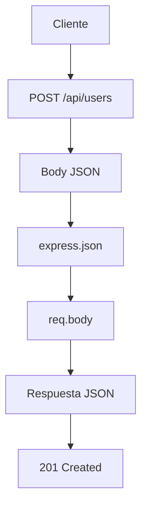

# Día 4: Métodos HTTP

## Objetivo del día

El objetivo del día 4 ha sido entender los métodos HTTP principales que se usan
en una API REST y crear una primera simulación de endpoints de usuarios.

En el día 3 se creó el endpoint:

```http
GET /api/health
```

Ese endpoint servía para comprobar que la API estaba funcionando. En este día
se ha dado un paso más: usar diferentes métodos HTTP para expresar acciones
distintas sobre un mismo recurso.

El recurso usado para practicar ha sido:

```http
/api/users
```

Todavía no se ha creado un CRUD real con base de datos. Las rutas devuelven
respuestas simuladas para practicar cómo se comporta una API cuando recibe
peticiones de consulta, creación, actualización y eliminación.

## Qué he hecho

- He repasado los métodos HTTP `GET`, `POST`, `PATCH` y `DELETE`.
- He relacionado esos métodos con operaciones CRUD.
- He creado endpoints temporales para usuarios.
- He usado `req.body` para leer datos enviados en el body.
- He usado `req.params` para leer parámetros de ruta.
- He devuelto respuestas JSON simuladas.
- He usado códigos de estado como `200 OK` y `201 Created`.
- He preparado ejemplos para probar las rutas con Thunder Client o Postman.
- He documentado el avance del día 4.

## Conceptos trabajados

| Concepto | Qué significa |
| --- | --- |
| Método HTTP | Acción que se quiere realizar sobre un recurso |
| `GET` | Consultar información |
| `POST` | Crear información |
| `PATCH` | Modificar parcialmente un recurso |
| `DELETE` | Eliminar o desactivar un recurso |
| CRUD | Operaciones básicas sobre datos: crear, leer, actualizar y eliminar |
| Body | Datos enviados por el cliente en una petición |
| Parámetro de ruta | Parte variable de una URL, como `:id` |
| Status code | Código que comunica el resultado de una petición |

## Relación entre CRUD y métodos HTTP

CRUD significa:

| Operación | Significado | Método HTTP habitual | Ejemplo |
| --- | --- | --- | --- |
| Create | Crear | `POST` | `POST /api/users` |
| Read | Leer | `GET` | `GET /api/users` |
| Read | Leer detalle | `GET` | `GET /api/users/:id` |
| Update | Actualizar | `PATCH` | `PATCH /api/users/:id` |
| Delete | Eliminar | `DELETE` | `DELETE /api/users/:id` |

La combinación entre método y ruta es lo que da significado al endpoint. Por
ejemplo, `GET /api/users` y `POST /api/users` comparten una ruta parecida, pero
representan acciones diferentes.

## Endpoints creados

### Listar usuarios

```http
GET /api/users
```

Uso:

```text
Obtener el listado de usuarios.
```

Respuesta simulada:

```json
{
  "message": "Listado de usuarios",
  "data": []
}
```

Por ahora `data` devuelve un array vacío porque todavía no hay base de datos.

### Ver detalle de usuario

```http
GET /api/users/:id
```

Ejemplo:

```http
GET /api/users/1
```

Respuesta simulada:

```json
{
  "message": "Detalle de usuario",
  "id": "1"
}
```

En esta ruta se usa un parámetro dinámico. La parte `:id` indica que ese valor
puede cambiar en cada petición.

### Crear usuario

```http
POST /api/users
```

Body de ejemplo:

```json
{
  "name": "Laura Martínez",
  "email": "laura@email.com",
  "password": "123456"
}
```

Respuesta simulada:

```json
{
  "message": "Usuario recibido para crear",
  "data": {
    "name": "Laura Martínez",
    "email": "laura@email.com",
    "password": "123456"
  }
}
```

Cuando una creación se realiza correctamente, el código de estado habitual es:

```http
201 Created
```

En este proyecto, de momento, el servidor no guarda el usuario. Solo devuelve
los datos recibidos para confirmar que el body se está leyendo correctamente.

### Actualizar usuario

```http
PATCH /api/users/:id
```

Ejemplo:

```http
PATCH /api/users/1
```

Body de ejemplo:

```json
{
  "name": "Laura García"
}
```

Respuesta simulada:

```json
{
  "message": "Usuario recibido para actualizar",
  "id": "1",
  "changes": {
    "name": "Laura García"
  }
}
```

`PATCH` permite enviar solo los campos que se quieren modificar. No obliga a
mandar el usuario completo.

### Eliminar o desactivar usuario

```http
DELETE /api/users/:id
```

Ejemplo:

```http
DELETE /api/users/1
```

Respuesta simulada:

```json
{
  "message": "Usuario recibido para eliminar o desactivar",
  "id": "1"
}
```

En proyectos reales, muchas veces no se borra físicamente un usuario. Es común
hacer un borrado lógico, por ejemplo cambiando un campo como:

```text
isActive = false
```

Esto permite conservar historial y evitar pérdidas de información.

## Código añadido

En `src/server.ts` se han añadido estas rutas:

```ts
app.get("/api/users", (req, res) => {
  res.status(200).json({
    message: "Listado de usuarios",
    data: []
  });
});

app.get("/api/users/:id", (req, res) => {
  const { id } = req.params;

  res.status(200).json({
    message: "Detalle de usuario",
    id: id
  });
});

app.post("/api/users", (req, res) => {
  const userData = req.body;

  res.status(201).json({
    message: "Usuario recibido para crear",
    data: userData
  });
});

app.patch("/api/users/:id", (req, res) => {
  const { id } = req.params;
  const changes = req.body;

  res.status(200).json({
    message: "Usuario recibido para actualizar",
    id: id,
    changes: changes
  });
});

app.delete("/api/users/:id", (req, res) => {
  const { id } = req.params;

  res.status(200).json({
    message: "Usuario recibido para eliminar o desactivar",
    id: id
  });
});
```

## Body de una petición

El body es el cuerpo de la petición. Sirve para enviar datos al servidor,
especialmente en métodos como `POST` y `PATCH`.

Este proyecto puede leer JSON gracias a esta línea:

```ts
app.use(express.json());
```

Sin ese middleware, Express no interpretaría correctamente los datos enviados en
formato JSON.

Ejemplo de lectura del body:

```ts
app.post("/api/users", (req, res) => {
  const userData = req.body;

  res.status(201).json({
    message: "Usuario recibido para crear",
    data: userData
  });
});
```

## Parámetros de ruta

Un parámetro de ruta permite trabajar con partes variables de la URL.

Estas URLs representan distintos usuarios:

```http
GET /api/users/1
GET /api/users/2
GET /api/users/25
```

En Express se define una sola ruta dinámica:

```ts
app.get("/api/users/:id", (req, res) => {
  const { id } = req.params;

  res.json({
    message: "Detalle de usuario",
    id: id
  });
});
```

La parte `:id` se puede leer desde:

```ts
req.params
```

## Pruebas realizadas

Para probar las rutas, primero se arranca el servidor:

```bash
npm run dev
```

Después se pueden enviar peticiones desde Thunder Client, Postman o una
herramienta similar.

| Petición | Body | Código esperado | Resultado esperado |
| --- | --- | ---: | --- |
| `GET /api/users` | No | 200 | Devuelve el listado simulado |
| `GET /api/users/1` | No | 200 | Devuelve el id recibido |
| `POST /api/users` | Sí | 201 | Devuelve los datos enviados |
| `PATCH /api/users/1` | Sí | 200 | Devuelve el id y los cambios |
| `DELETE /api/users/1` | No | 200 | Devuelve el id recibido |

## Flujo de una petición con body



## Estado actual del proyecto

La estructura del proyecto después del día 4 es:

```text
usermanager-api/
  README.md
  package.json
  package-lock.json
  tsconfig.json
  src/
    server.ts
  docs/
    dia_01_diseno_inicial.md
    dia_02_preparacion_proyecto.md
    dia_03_primer_endpoint.md
    dia_04_metodos_http.md
```

## Resumen

En el día 4 se han preparado las primeras rutas simuladas de usuarios para
entender cómo una API REST usa métodos HTTP distintos según la acción que se
quiere realizar.

El proyecto ya permite practicar:

```text
Consultar usuarios con GET.
Crear usuarios con POST.
Actualizar usuarios con PATCH.
Eliminar o desactivar usuarios con DELETE.
Leer datos del body con req.body.
Leer parámetros de ruta con req.params.
```

Estas rutas son temporales, pero dejan preparada la base conceptual para crear
más adelante el CRUD real de usuarios con validaciones, persistencia y base de
datos.
