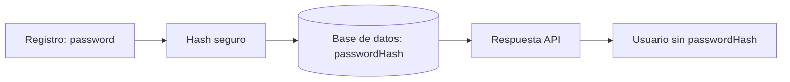
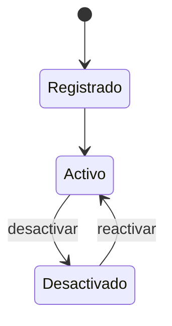

# Día 18: Diseño del modelo persistente User

## Objetivo del día

El objetivo del día 18 ha sido diseñar cómo se representará un usuario cuando
la API utilice almacenamiento persistente. Este diseño conecta el array actual
en memoria con el futuro modelo Prisma y la tabla real de PostgreSQL.

Hoy no se ha creado ninguna tabla ni se ha instalado un ORM. Primero se han
definido los datos, las restricciones y las reglas de negocio que deberá
respetar la implementación.

## Qué he hecho

- He analizado qué datos necesita guardar un usuario.
- He diferenciado entre usuario en memoria y usuario persistente.
- He definido los campos principales del modelo `User`.
- He identificado qué campos son obligatorios y cuáles deben ser únicos.
- He marcado `passwordHash` como dato sensible.
- He definido los valores predeterminados de `role` e `isActive`.
- He distinguido los modelos de entrada, persistencia y salida.
- He preparado un posible modelo Prisma para una fase posterior.
- He definido permisos iniciales para los roles `USER` y `ADMIN`.
- He representado el ciclo de vida de una cuenta.

## Del usuario en memoria al modelo persistente

El array en memoria ha sido suficiente para practicar el CRUD, pero no contiene
todavía toda la información necesaria para registro, autenticación, permisos y
auditoría.

La evolución prevista es:

```text
Usuario en memoria
        ↓
Modelo persistente conceptual
        ↓
Modelo Prisma
        ↓
Tabla real en PostgreSQL
```

El modelo conceptual permite decidir las reglas antes de expresarlas mediante
la sintaxis concreta de una herramienta.

## Campos del modelo `User`

| Campo | Tipo conceptual | Obligatorio | Único | Valor por defecto | Se devuelve al cliente |
| --- | --- | --- | --- | --- | --- |
| `id` | número | sí | sí | automático | sí |
| `name` | texto | sí | no | no | sí |
| `email` | texto | sí | sí | no | sí |
| `passwordHash` | texto | sí | no | no | no |
| `role` | `USER` / `ADMIN` | sí | no | `USER` | sí |
| `isActive` | booleano | sí | no | `true` | sí |
| `createdAt` | fecha | sí | no | automático | sí |
| `updatedAt` | fecha | sí | no | automático | sí |

### Responsabilidad de cada campo

- `id` identifica al usuario de forma única y lo genera el sistema.
- `name` contiene el nombre visible, sin espacios exteriores.
- `email` identifica la cuenta y se guarda con `trim().toLowerCase()`.
- `passwordHash` almacena el resultado seguro de procesar la contraseña.
- `role` determina los permisos y comienza como `USER`.
- `isActive` permite el borrado lógico y comienza como `true`.
- `createdAt` registra automáticamente la creación de la cuenta.
- `updatedAt` cambia automáticamente al modificar el registro.

## Reglas del modelo

- El email no se puede repetir.
- El email debe guardarse normalizado.
- El nombre no puede estar vacío y debe guardarse sin espacios exteriores.
- La contraseña nunca se guarda en texto plano.
- `passwordHash` nunca se devuelve al cliente.
- Todo usuario tiene un rol.
- El rol predeterminado es `USER`.
- Todo usuario se crea activo.
- Un usuario desactivado no puede iniciar sesión.
- `createdAt` se genera al crear el usuario.
- `updatedAt` cambia cuando el usuario se modifica.
- El cliente no decide los campos automáticos ni los valores privilegiados.

Estas reglas deberán aplicarse en la API y, cuando sea posible, reforzarse con
restricciones de la base de datos.

## Entrada, persistencia y salida

No se debe utilizar una única representación del usuario para todas las capas:

| Representación | Qué significa | Contiene `password` | Contiene `passwordHash` |
| --- | --- | --- | --- |
| Entrada | Datos que envía el cliente | sí | no |
| Persistencia | Datos guardados en la base de datos | no | sí |
| Salida | Datos que devuelve la API | no | no |

### Ejemplo de entrada

```json
{
  "name": "Ana García",
  "email": "ana@email.com",
  "password": "123456"
}
```

La contraseña existe momentáneamente mientras la API valida y procesa la
petición. No forma parte del modelo persistente.

### Ejemplo de persistencia

```text
id: 1
name: Ana García
email: ana@email.com
passwordHash: $2b$10$...
role: USER
isActive: true
createdAt: fecha automática
updatedAt: fecha automática
```

### Ejemplo de salida

```json
{
  "id": 1,
  "name": "Ana García",
  "email": "ana@email.com",
  "role": "USER",
  "isActive": true,
  "createdAt": "2026-01-01T10:00:00.000Z",
  "updatedAt": "2026-01-01T10:00:00.000Z"
}
```

Ni `password` ni `passwordHash` aparecen en la respuesta.

## Por qué guardamos `passwordHash` y no `password`

Guardar contraseñas en texto plano permitiría que cualquier persona con acceso
indebido a la base de datos leyera inmediatamente las credenciales de todos los
usuarios. Como muchas personas reutilizan contraseñas, el daño podría alcanzar
también otros servicios.

La API transformará la contraseña mediante un algoritmo específico para
contraseñas, como bcrypt. Durante el login no será necesario recuperar el texto
original: se comparará la contraseña recibida con el hash almacenado.



La contraseña solo llega desde el cliente durante el registro o el login. La
API nunca debe devolver ni la contraseña original ni su hash.

## Roles y permisos iniciales

| Acción | `USER` | `ADMIN` |
| --- | :---: | :---: |
| Ver su propio perfil | sí | sí |
| Listar todos los usuarios | no | sí |
| Cambiar su propio nombre | sí | sí |
| Cambiar su rol | no | sí |
| Desactivar usuarios | no | sí |
| Cambiar su propia contraseña | sí | sí |

El rol no es solo un texto informativo: será una regla de autorización. Un
usuario normal no debe poder conseguir privilegios enviando `role: "ADMIN"` en
una petición.

## Borrado lógico y ciclo de vida

El campo `isActive` permite desactivar una cuenta sin borrar físicamente su
registro. Así se conserva el historial y un administrador puede reactivarla.



Una cuenta se crea activa. Mientras esté desactivada, seguirá existiendo en la
base de datos, pero no podrá iniciar sesión.

## Campos opcionales futuros

El modelo podría ampliarse más adelante sin que estos campos sean obligatorios:

| Campo | Tipo conceptual | Utilidad | Se devuelve al cliente |
| --- | --- | --- | --- |
| `avatarUrl` | texto / URL | Guardar la imagen de perfil | sí |
| `lastLoginAt` | fecha opcional | Registrar el último inicio de sesión correcto | solo cuando proceda |

`avatarUrl` sería opcional porque no todas las cuentas necesitan una imagen.
`lastLoginAt` comenzaría sin valor hasta el primer login y su exposición podría
limitarse al propietario o a administradores por motivos de privacidad.

## Posible modelo Prisma futuro

El diseño podría expresarse más adelante con un modelo parecido a este:

```prisma
model User {
  id           Int      @id @default(autoincrement())
  name         String
  email        String   @unique
  passwordHash String
  role         Role     @default(USER)
  isActive     Boolean  @default(true)
  createdAt    DateTime @default(now())
  updatedAt    DateTime @updatedAt
}

enum Role {
  USER
  ADMIN
}
```

Este código es una referencia de diseño. Prisma todavía no se ha instalado ni
se ha creado una migración.

## Dudas para elegir herramienta de acceso a datos

Antes de elegir entre SQL directo, Prisma, TypeORM o Sequelize conviene resolver
estas preguntas:

1. ¿Qué herramienta ofrece mejor integración y tipado con TypeScript?
2. ¿Cuál permite definir modelos y relaciones de forma más clara?
3. ¿Cómo gestiona cada opción las migraciones y los cambios de esquema?
4. ¿Qué errores puede detectar durante el desarrollo antes de ejecutar código?
5. ¿Cuánta flexibilidad conserva para escribir consultas SQL complejas?
6. ¿Cuál tiene una curva de aprendizaje y mantenimiento adecuada para el
   proyecto?

## Resumen

Se ha diseñado el modelo persistente `User` con sus campos, valores
predeterminados, restricciones y datos sensibles. También se han separado las
representaciones de entrada, persistencia y salida para impedir que las
credenciales se almacenen o expongan de forma incorrecta.

Este diseño será la referencia para escoger la herramienta de acceso a datos,
crear el modelo real y generar la futura tabla de usuarios en PostgreSQL.
