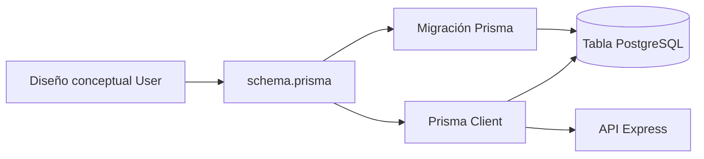

# Día 19: ORM o acceso a datos

## Objetivo del día

El objetivo del día 19 ha sido entender cómo podrá la API leer y escribir datos
en PostgreSQL, comparar distintas herramientas y tomar una decisión técnica
razonada para las siguientes fases del proyecto.

La decisión es utilizar Prisma como ORM principal de UserManager API. Hoy no se
ha instalado ni configurado: esa implementación comenzará en el Día 20.

## Qué he hecho

- He entendido qué significa acceso a datos.
- He aprendido qué es un ORM y qué problema resuelve.
- He comparado SQL directo, Prisma, TypeORM y Sequelize.
- He analizado las ventajas y los inconvenientes de cada opción.
- He comparado una consulta SQL con su equivalente conceptual en Prisma.
- He relacionado el acceso a datos con el modelo persistente `User`.
- He situado Prisma dentro de la futura arquitectura por capas.
- He decidido usar Prisma como herramienta principal del proyecto.

## Qué es el acceso a datos

El acceso a datos es la parte del backend encargada de leer y escribir
información en la base de datos. En este proyecto permitirá crear, consultar,
modificar y desactivar usuarios almacenados en PostgreSQL.

Hasta ahora, el array en memoria se manipulaba con métodos de JavaScript:

```ts
users.find(...);
users.push(...);
users.filter(...);
```

Con una base de datos real, esas operaciones necesitan pasar por una herramienta
capaz de comunicarse con PostgreSQL:

```text
Cliente HTTP -> API Express -> Capa de acceso a datos -> PostgreSQL
```

## Qué es un ORM

ORM significa *Object-Relational Mapping*. Es una capa que permite expresar
operaciones de base de datos mediante modelos y métodos del lenguaje de
programación, reduciendo la cantidad de SQL repetitivo que debe escribirse a
mano.

La base de datos no desaparece: PostgreSQL continúa almacenando los datos y
ejecutando consultas. El ORM traduce las operaciones del código y ayuda con el
mapeo de tipos, modelos, relaciones y migraciones.

Un ORM mejora la organización de las operaciones comunes, pero no sustituye la
necesidad de comprender SQL, restricciones, índices o el comportamiento de la
base de datos.

## Comparación de opciones

| Opción | Cómo se trabaja | Ventaja principal | Inconveniente principal |
| --- | --- | --- | --- |
| SQL directo | Escribiendo consultas SQL | Máxima transparencia y control | Más código y mapeo manual |
| Prisma | Modelos en `schema.prisma` y cliente tipado | Integración clara con TypeScript | Hay que aprender su ecosistema |
| TypeORM | Clases, entidades y decoradores | Enfoque orientado a objetos | Más configuración inicial |
| Sequelize | Modelos ORM clásicos | Amplia trayectoria en Node.js | Menos natural con TypeScript moderno |

Todas son opciones válidas. La elección depende del lenguaje, la experiencia
del equipo, la complejidad de las consultas y las necesidades del proyecto.

## SQL directo frente a Prisma

Ejemplo conceptual con SQL directo y una librería como `pg`:

```ts
const result = await pool.query(
  "SELECT * FROM users WHERE id = $1",
  [id]
);
```

Ejemplo conceptual con Prisma:

```ts
const user = await prisma.user.findUnique({
  where: { id }
});
```

Ambos enfoques buscan un usuario por ID. SQL directo expresa la consulta que
recibe PostgreSQL; Prisma expresa la intención desde el modelo `User` y aporta
tipos generados para la consulta y su resultado.

### Comparación ampliada

| Aspecto | SQL directo | Prisma |
| --- | --- | --- |
| Cómo se escriben consultas | Sentencias SQL manuales | Métodos de Prisma Client |
| Relación con TypeScript | Tipos y mapeo principalmente manuales | Cliente y resultados tipados |
| Facilidad inicial | Directo si ya se conoce SQL | Requiere aprender el esquema y el cliente |
| Control sobre SQL | Muy alto | Más abstracto en operaciones habituales |
| Código manual | Mayor | Menor para un CRUD común |
| Migraciones | Requieren otra herramienta o scripts propios | Prisma Migrate integrado |
| Herramienta visual | Depende de herramientas externas | Prisma Studio incluido |

SQL directo ofrece control fino y sigue siendo útil para consultas específicas.
Prisma aporta coherencia y productividad para el acceso habitual del proyecto.

## Decisión técnica

Para este reto se utilizará Prisma como ORM principal.

Los motivos son:

- Encaja bien con TypeScript.
- Permite definir modelos de forma legible.
- Genera un cliente tipado a partir del esquema.
- Incluye un sistema para crear y aplicar migraciones.
- Reduce el SQL repetitivo del CRUD.
- Incluye Prisma Studio para inspeccionar datos.
- Se integra bien con una arquitectura por capas.

SQL directo, TypeORM y Sequelize se han analizado como alternativas. SQL sigue
siendo esencial para entender qué ocurre debajo del ORM y podrá utilizarse en
casos concretos si una consulta lo requiere.

## Por qué elegimos Prisma

El tipado generado es especialmente útil en un proyecto TypeScript: si cambia
el modelo, el compilador puede señalar operaciones que ya no coinciden con él.
Esto reduce errores entre el código y la base de datos.

Además, `schema.prisma` concentra una descripción clara del modelo persistente,
mientras Prisma Migrate registra la evolución del esquema de PostgreSQL. Esa
combinación facilita seguir el aprendizaje paso a paso y mantener reproducible
la estructura de la base de datos.

La elección no significa que Prisma sea universalmente superior. Es la opción
que mejor equilibra claridad, tipado, migraciones y curva de aprendizaje para
los objetivos concretos de este reto.

## Prisma Studio

Prisma Studio será una interfaz visual para inspeccionar los datos gestionados
por Prisma. Durante el reto permitirá:

- Ver los registros de cada modelo.
- Crear o editar datos durante el desarrollo.
- Comprobar si una migración ha creado la estructura esperada.
- Revisar los usuarios generados por un futuro *seed*.
- Detectar rápidamente valores o relaciones incorrectos.

Será una herramienta de desarrollo y exploración, no una interfaz de
administración que deba exponerse como parte pública de la API.

## Prisma dentro de la arquitectura

Más adelante, Prisma se utilizará principalmente desde la capa de repositorio:

```text
Route -> Controller -> Service -> Repository -> Prisma -> PostgreSQL
```

| Capa | Responsabilidad | ¿Usa Prisma directamente? |
| --- | --- | :---: |
| Route | Define rutas y middlewares | no |
| Controller | Maneja la petición y la respuesta HTTP | no |
| Service | Aplica las reglas de negocio | no |
| Repository | Ejecuta las operaciones de acceso a datos | sí |
| Prisma | Traduce operaciones y se comunica con PostgreSQL | sí |

Esta separación evita mezclar detalles de PostgreSQL con rutas o reglas de
negocio. También permite cambiar o probar una capa con menos impacto sobre las
demás.

## Relación con el modelo `User`

En el Día 18 se diseñaron estos campos:

- `id`
- `name`
- `email`
- `passwordHash`
- `role`
- `isActive`
- `createdAt`
- `updatedAt`

El diseño se convertirá en un modelo `User` dentro de `schema.prisma`. Después,
una migración traducirá ese modelo a una tabla real y Prisma Client permitirá
consultarla desde TypeScript.



El diagrama muestra dos resultados del esquema: las migraciones hacen evolucionar
la estructura de PostgreSQL y el cliente generado ofrece a la API una interfaz
tipada para acceder a ella.

## Próximos pasos

La secuencia prevista para incorporar Prisma es:

1. Instalar y configurar Prisma.
2. Definir `User` y `Role` en `schema.prisma`.
3. Crear la primera migración.
4. Inspeccionar los datos con Prisma Studio.
5. Preparar un *seed* de datos iniciales.
6. Integrar el acceso persistente en la arquitectura de la API.

## Resumen

Se han comparado cuatro alternativas de acceso a PostgreSQL y se ha elegido
Prisma como ORM principal por su integración con TypeScript, su cliente tipado,
sus migraciones y la claridad de sus modelos.

Prisma ocupará la parte de acceso a datos situada entre los repositorios y
PostgreSQL. Hoy queda tomada la decisión; la instalación y la implementación se
realizarán a partir del Día 20.
