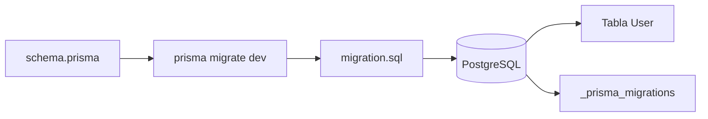

# Día 22: Primera migración con Prisma

## Objetivo del día

El objetivo del día 22 ha sido crear y aplicar la primera migración de Prisma
para convertir el modelo `User` de `schema.prisma` en una tabla real de
PostgreSQL.

En el Día 21 definimos el enum `Role` y el modelo `User`. Hoy hemos usado
Prisma Migrate para versionar ese cambio y dejarlo registrado en el
repositorio.

## Qué he hecho

- He revisado que PostgreSQL estuviera arrancado.
- He comprobado que `DATABASE_URL` apunta a la base de datos local.
- He validado el archivo `prisma/schema.prisma`.
- He ejecutado la primera migración con Prisma.
- He creado la carpeta `prisma/migrations/`.
- He revisado el archivo `migration.sql`.
- He comprobado que la migración crea el enum `Role`.
- He comprobado que la migración crea la tabla `User`.
- He comprobado que la migración crea el índice único de `email`.
- He entendido la diferencia entre modelo, migración y tabla.

## Comando principal

La migración inicial se ha creado con:

```bash
npx prisma migrate dev --name init_user
```

El proyecto también incluye este script:

```bash
npm run prisma:migrate -- --name init_user
```

`prisma migrate dev` lee el esquema, genera el SQL necesario, aplica la
migración en la base de datos de desarrollo y actualiza el historial interno de
Prisma.

## Archivos generados

La migración creada en este proyecto es:

```text
prisma/migrations/
  20260708053452_init_user/
    migration.sql
  migration_lock.toml
```

`migration.sql` contiene las instrucciones SQL generadas por Prisma.

`migration_lock.toml` indica el proveedor usado por las migraciones:

```toml
provider = "postgresql"
```

## Qué es una migración

Una migración es un cambio versionado en la estructura de la base de datos.

Permite crear, modificar o eliminar tablas de forma controlada y reproducible.
En lugar de crear tablas manualmente desde Adminer, el cambio queda guardado en
el repositorio y puede aplicarse de nuevo en otro entorno.

En este caso, la migración inicial convierte el modelo `User` en una tabla real
dentro de PostgreSQL.

## Modelo, migración y tabla

| Concepto | Dónde está | Para qué sirve |
| --- | --- | --- |
| Modelo | `prisma/schema.prisma` | Define cómo queremos que sea la estructura |
| Migración | `prisma/migrations/.../migration.sql` | Guarda el cambio generado |
| Tabla | PostgreSQL | Almacena los datos reales |

El flujo correcto es:

```text
schema.prisma -> prisma migrate dev -> migration.sql -> PostgreSQL
```

## Qué hace `prisma migrate dev`

El comando `prisma migrate dev` realiza varios pasos:

1. Lee `prisma/schema.prisma`.
2. Detecta cambios en el modelo.
3. Genera una migración SQL.
4. Aplica la migración sobre la base de datos de desarrollo.
5. Registra el cambio en `_prisma_migrations`.
6. Genera Prisma Client.

Esto mantiene sincronizados el esquema, el historial de migraciones y la base de
datos local.

## SQL generado

El archivo `migration.sql` contiene la traducción del modelo Prisma a SQL para
PostgreSQL.

Creación del enum `Role`:

```sql
CREATE TYPE "Role" AS ENUM ('USER', 'ADMIN');
```

Creación de la tabla `User`:

```sql
CREATE TABLE "User" (
    "id" SERIAL NOT NULL,
    "name" TEXT NOT NULL,
    "email" TEXT NOT NULL,
    "passwordHash" TEXT NOT NULL,
    "role" "Role" NOT NULL DEFAULT 'USER',
    "isActive" BOOLEAN NOT NULL DEFAULT true,
    "createdAt" TIMESTAMP(3) NOT NULL DEFAULT CURRENT_TIMESTAMP,
    "updatedAt" TIMESTAMP(3) NOT NULL,

    CONSTRAINT "User_pkey" PRIMARY KEY ("id")
);
```

Creación del índice único de email:

```sql
CREATE UNIQUE INDEX "User_email_key" ON "User"("email");
```

Estos fragmentos confirman que Prisma ha creado:

- El enum `Role`.
- La tabla `User`.
- La clave primaria `User_pkey`.
- La restricción de email único.

## Tablas creadas

Después de aplicar la migración, PostgreSQL contiene:

```text
User
_prisma_migrations
```

Además, PostgreSQL tiene el tipo enum:

```text
Role
```

La tabla `User` almacena los usuarios de la aplicación.

La tabla `_prisma_migrations` guarda el historial interno de Prisma. No debe
editarse manualmente.

## Campos de la tabla `User`

La tabla `User` contiene estos campos:

```text
id
name
email
passwordHash
role
isActive
createdAt
updatedAt
```

Relación con el modelo Prisma:

| Campo | SQL generado | Regla |
| --- | --- | --- |
| `id` | `SERIAL NOT NULL` | Clave primaria autoincremental |
| `name` | `TEXT NOT NULL` | Nombre obligatorio |
| `email` | `TEXT NOT NULL` | Email obligatorio |
| `passwordHash` | `TEXT NOT NULL` | Hash obligatorio |
| `role` | `"Role" NOT NULL DEFAULT 'USER'` | Rol controlado por enum |
| `isActive` | `BOOLEAN NOT NULL DEFAULT true` | Usuario activo por defecto |
| `createdAt` | `TIMESTAMP(3) NOT NULL DEFAULT CURRENT_TIMESTAMP` | Fecha automática |
| `updatedAt` | `TIMESTAMP(3) NOT NULL` | Fecha de modificación |

## Diagrama de migración



El diagrama resume el camino desde el modelo escrito en Prisma hasta la tabla
real en PostgreSQL.

## `migrate dev` frente a `db push`

| Comando | Crea migraciones | Se guarda en el repositorio | Uso principal |
| --- | :---: | :---: | --- |
| `prisma migrate dev` | sí | sí | Desarrollo con historial versionado |
| `prisma db push` | no | no | Prototipos rápidos o sincronización sin historial |

En este reto usamos `prisma migrate dev` porque queremos aprender una forma más
ordenada y profesional de evolucionar la estructura de la base de datos.

## Por qué versionar la base de datos

La estructura de la base de datos también forma parte del código del proyecto.

Versionarla tiene varias ventajas:

- El proyecto puede reconstruirse desde cero.
- Otra persona puede aplicar la misma estructura.
- Los cambios quedan registrados en Git.
- Es más fácil revisar cuándo apareció cada tabla o columna.
- Se evita depender de pasos manuales hechos desde Adminer.
- El esquema evoluciona junto al código de la API.

Crear tablas manualmente puede servir para una prueba puntual, pero no deja un
historial claro. Las migraciones sí lo hacen.

## Problema frecuente: drift

Antes de crear esta migración puede aparecer un aviso de Prisma indicando que la
base de datos no coincide con el historial de migraciones.

En este proyecto ocurrió porque existía una tabla de prueba llamada
`test_connection`, creada antes de usar Prisma Migrate.

Ese tipo de tabla provoca que Prisma detecte diferencias entre:

- Lo que espera según sus migraciones.
- Lo que existe realmente en PostgreSQL.

Para una base de datos de desarrollo, la solución habitual es eliminar la tabla
de prueba o resetear el esquema si no hay datos importantes.

## Qué no hemos hecho hoy

Hoy no hemos creado usuarios.

La tabla `User` ya existe, pero todavía debe estar vacía. Los datos iniciales se
crearán más adelante mediante un seed.

Tampoco hemos escrito todavía código de API que use Prisma Client. Hoy el foco
ha sido exclusivamente la estructura de base de datos.

## Resumen

El Día 22 convierte el modelo Prisma `User` en una tabla real de PostgreSQL.

Ahora el proyecto tiene:

- Un modelo `User` en `schema.prisma`.
- Una migración inicial versionada.
- Un archivo `migration.sql`.
- El enum `Role` en PostgreSQL.
- La tabla `User`.
- El historial `_prisma_migrations`.

El siguiente paso será explorar la base de datos y preparar datos iniciales de
forma controlada.
