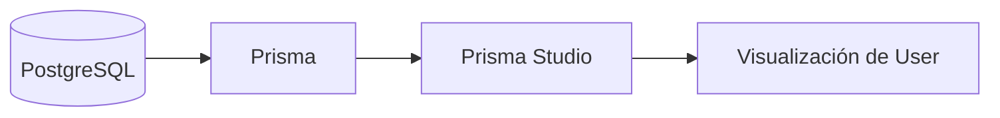

# Día 23: Prisma Studio

## Objetivo del día

El objetivo del día 23 ha sido explorar visualmente la base de datos con Prisma
Studio.

En el Día 22 creamos la primera migración y PostgreSQL quedó preparado con la
tabla `User` y el historial `_prisma_migrations`. Hoy usamos Prisma Studio como
herramienta de desarrollo para comprobar qué hay realmente guardado en la base
de datos.

## Qué he hecho

- He comprobado que PostgreSQL debe estar arrancado antes de abrir Prisma
  Studio.
- He revisado que existe la migración inicial.
- He identificado el script `prisma:studio`.
- He documentado la URL habitual de Prisma Studio.
- He revisado qué campos deben verse en el modelo `User`.
- He diferenciado Prisma Studio de la API.
- He comparado Prisma Studio con Adminer.
- He documentado cómo probar restricciones del modelo.
- He preparado el terreno para el seed del Día 24.

## Comando usado

Prisma Studio se puede abrir con:

```bash
npx prisma studio
```

O mediante el script del proyecto:

```bash
npm run prisma:studio
```

## URL habitual

Normalmente Prisma Studio queda disponible en:

```text
http://localhost:5555
```

Si el navegador no se abre automáticamente, se puede copiar la URL que aparece
en la terminal y pegarla manualmente.

Para cerrar Prisma Studio, hay que volver a la terminal donde se está ejecutando
y pulsar `Ctrl + C`.

## Qué es Prisma Studio

Prisma Studio es una herramienta visual que permite explorar y editar los datos
de la base de datos asociada al proyecto Prisma.

Sirve para responder una pregunta muy práctica durante el desarrollo:

```text
¿Qué hay realmente guardado en la base de datos?
```

Con Prisma Studio podemos:

- Ver tablas y registros.
- Revisar columnas.
- Crear registros temporales.
- Editar datos durante pruebas.
- Eliminar datos manuales.
- Comprobar valores por defecto.
- Observar restricciones como `@unique` y enums.

## Prisma Studio no es la API

Prisma Studio es una herramienta para desarrollo.

La API Express es el producto que estamos construyendo.

| Herramienta | Para qué sirve |
| --- | --- |
| API Express | Responder peticiones HTTP |
| Prisma | Comunicar TypeScript con PostgreSQL |
| PostgreSQL | Guardar los datos reales |
| Prisma Studio | Ver y editar datos visualmente |
| Thunder/Postman | Probar endpoints HTTP |
| Frontend entregado | Probar la API como cliente real |

En una aplicación real, los usuarios se crearán desde endpoints como:

```http
POST /api/auth/register
POST /api/users
```

Prisma Studio solo debe usarse como apoyo durante el desarrollo.

## Prisma Studio frente a Adminer

| Herramienta | Para qué sirve |
| --- | --- |
| Adminer | Gestionar la base de datos de forma general |
| Prisma Studio | Ver y editar datos desde el modelo Prisma |

Adminer muestra PostgreSQL desde un punto de vista más general.

Prisma Studio está más integrado con el proyecto Prisma y muestra los datos
desde la perspectiva de los modelos definidos en `schema.prisma`.

Para este reto, ambas herramientas son útiles:

- Adminer ayuda a inspeccionar PostgreSQL de forma directa.
- Prisma Studio ayuda a revisar los modelos gestionados por Prisma.

## Tabla revisada

El modelo principal que debe aparecer en Prisma Studio es:

```text
User
```

Si no aparece, conviene revisar:

- Que `model User` exista en `prisma/schema.prisma`.
- Que la migración del Día 22 se haya aplicado.
- Que `DATABASE_URL` apunte a la base de datos correcta.
- Que PostgreSQL esté arrancado.

## Campos observados

La tabla `User` debe mostrar los campos definidos en el modelo Prisma:

```text
id
name
email
passwordHash
role
isActive
createdAt
updatedAt
```

Relación con el modelo:

| Campo | Tipo o valores esperados |
| --- | --- |
| `id` | Número |
| `name` | Texto |
| `email` | Texto único |
| `passwordHash` | Texto |
| `role` | `USER` o `ADMIN` |
| `isActive` | Booleano |
| `createdAt` | Fecha |
| `updatedAt` | Fecha |

## Restricciones que se pueden observar

Prisma Studio permite comprobar visualmente reglas que vienen del modelo:

| Regla | Dónde se define | Qué debería ocurrir |
| --- | --- | --- |
| Email único | `email String @unique` | No acepta dos usuarios con el mismo email |
| Rol controlado | `enum Role` | Solo permite `USER` o `ADMIN` |
| Activo/inactivo | `isActive Boolean` | Solo permite `true` o `false` |
| Usuario activo por defecto | `@default(true)` | Un usuario nuevo empieza activo |
| Fecha de creación | `@default(now())` | Se rellena al crear el registro |
| Fecha de modificación | `@updatedAt` | Cambia al modificar el registro |

Estas comprobaciones ayudan a confirmar que la migración y el modelo se
comportan como esperamos.

## Crear un usuario temporal

Como práctica, se puede crear un usuario temporal desde Prisma Studio:

| Campo | Valor |
| --- | --- |
| `name` | `Usuario Temporal` |
| `email` | `temporal@email.com` |
| `passwordHash` | `hash_temporal` |
| `role` | `USER` |
| `isActive` | `true` |

Después de guardarlo, conviene observar:

- Que `id` se genera automáticamente.
- Que `createdAt` se rellena.
- Que `updatedAt` se rellena.
- Que `role` respeta el enum.
- Que `isActive` se puede cambiar a `false`.

## Borrar el usuario temporal

Al terminar la práctica, es recomendable borrar el usuario temporal.

El Día 24 creará datos iniciales mediante un seed. Si dejamos registros
manuales, la base de datos puede quedar mezclada con datos de prueba que no
forman parte del flujo controlado del proyecto.

Si se decide conservar un usuario manual, conviene documentarlo claramente.

## Diferencia entre migración y seed

| Concepto | Qué hace |
| --- | --- |
| Migración | Crea o modifica la estructura de la base de datos |
| Seed | Inserta datos iniciales |

La migración del Día 22 creó la tabla `User`.

El seed del Día 24 creará usuarios iniciales dentro de esa tabla.

## Diagrama de funcionamiento



Prisma Studio se conecta a la base de datos usando la configuración de Prisma y
permite visualizar los modelos como tablas editables.

## Comparación de herramientas de prueba

| Herramienta | Qué prueba |
| --- | --- |
| Thunder/Postman | Endpoints HTTP de la API |
| Prisma Studio | Datos guardados desde la perspectiva de Prisma |
| Adminer | Estructura y datos de PostgreSQL de forma general |
| Frontend entregado | Flujo real de usuario contra la API |

Cada herramienta observa una parte distinta del sistema. Prisma Studio es
especialmente útil para verificar persistencia.

## Preparación para el seed

Para el Día 24, una propuesta mínima de usuarios iniciales sería:

| Nombre | Email | Rol | Estado |
| --- | --- | --- | --- |
| Admin Principal | `admin@email.com` | `ADMIN` | activo |
| Usuario Demo | `user@email.com` | `USER` | activo |
| Usuario Inactivo | `inactive@email.com` | `USER` | inactivo |

Estos usuarios permitirán probar:

- Login con distintos roles.
- Listado de usuarios.
- Filtros por estado.
- Activación y desactivación.
- Protección de rutas administrativas.

## Problemas frecuentes

### Prisma Studio no se abre

Ejecuta:

```bash
npx prisma studio
```

Y copia manualmente la URL que aparezca en la terminal.

### Error de conexión

Comprueba:

- Que PostgreSQL esté arrancado.
- Que `DATABASE_URL` sea correcta.
- Que el puerto coincida con Docker Compose.
- Que la base de datos exista.

Comandos útiles:

```bash
docker compose up -d
docker compose ps
```

### No aparece `User`

Comprueba que existe la migración inicial:

```text
prisma/migrations/20260708053452_init_user/migration.sql
```

Y que el esquema contiene:

```prisma
model User {
  id           Int      @id @default(autoincrement())
  name         String
  email        String   @unique
  passwordHash String
  role         Role     @default(USER)
  isActive     Boolean  @default(true)
  createdAt    DateTime @default(now())
  updatedAt    DateTime @updatedAt
}
```

### La tabla aparece vacía

Es normal.

La migración crea estructura, no datos. Los datos iniciales llegarán con el seed
del Día 24.

## Resumen

Prisma Studio permite observar visualmente la base de datos desde el ecosistema
de Prisma.

En este día hemos documentado cómo abrirlo, qué revisar en la tabla `User`, cómo
probar restricciones y por qué no conviene dejar datos manuales antes del seed.

El proyecto ya puede inspeccionar la persistencia de forma visual. El siguiente
paso será crear datos iniciales de forma controlada.
